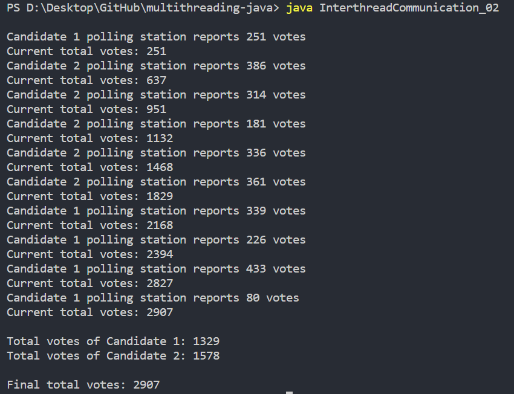

# multithreading-java
Hands-On Multithreading with Java

### (1) Outline of Code

[1] Hello, World
- HelloWorld.java

[2] Multithreading
- Multithreading_01.java
- Multithreading_02.java
- Multithreading_03.java

[3] Deadlock
- Deadlock_01.java
- Deadlock_02.java
- Deadlock_03.java

[4] Vote Counter
- VoteCounter_01.java
- VoteCounter_02.java
- VoteCounter_03.java

[5] Inter-thread Communication
- InterthreadCommunication_01.java
- InterthreadCommunication_02.java

[6] JoinThread
- JoinThread_01.java
- JoinThread_02.java

----

### (2) Output 

- InterthreadCommunication_02.java

  

