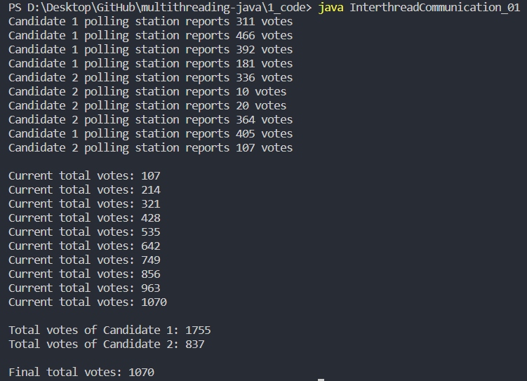

# multithreading-java
Hands-On Multithreading with Java

### (1) Outline of Code

[1] Hello, World
- HelloWorld.java

[2] Multithreading
- Multithreading_01.java
- Multithreading_02.java
- Multithreading_03.java

[3] Deadlock
- Deadlock_01.java
- Deadlock_02.java
- Deadlock_03.java

[4] Vote Counter
- VoteCounter_01.java
- VoteCounter_02.java
- VoteCounter_03.java

[5] Inter-thread Communication
- InterthreadCommunication_01.java
- InterthreadCommunication_02.java

[6] JoinThread
- JoinThread_01.java
- JoinThread_02.java

----

### (2) Output 

- 2-1 InterthreadCommunication_01.java

[2-1-1] 1755 (Candidate_1) + 837 (Candidate_2) = 2592 > 1070 (Final total votes)

  

[2-1-2] 771 (Candidate_1) + 1591 (Candidate_2) = 2362 < 2610 (Final total votes)

  

  

- 2-2 InterthreadCommunication_02.java

[2-2-1] 1329 (Candidate_1) + 1578 (Candidate_2) = 2907 (Final total votes)

  

